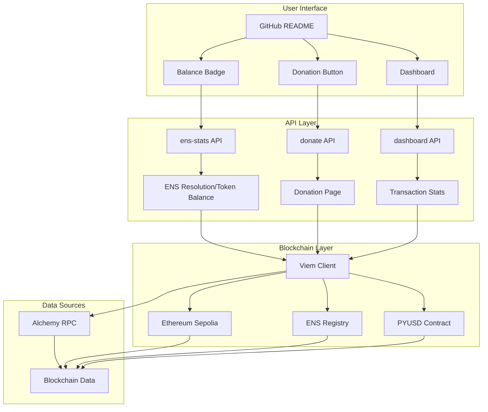

# GitPay

**A monetary layer on top of GitHub—humane and stable, thanks to ENS and PYUSD.**

<p align="center">
  
  <a href="https://gitpay-vert.vercel.app/donate?ens=shevxer.eth&amount=1" target="_blank">
    
  </a>
</p>
<p align="center">
  
</p>


GitPay is a decentralized payment system that enables seamless donations and payments using ENS (Ethereum Name Service) names and PYUSD (PayPal USD) stablecoin. Just add it in markdown, and it's good to go!

> **NOTE**: due to too many alchemy requests the dashboard api is temporarily not working 🚧
## Features

- **Dynamic SVG Generation**: Real-time, server-side generated SVG badges and components
- **Multiple Themes**: Light, dark, and neon themes with custom styling and animations
- **Interactive Dashboards**: Comprehensive transaction history with live data visualization
- **One-Click Donations**: Seamless donation buttons with MetaMask integration
- **ENS Integration**: Human-readable names instead of complex wallet addresses
- **Serverless Architecture**: Built on Vercel serverless functions for optimal performance
- **Real-time Updates**: Live balance and transaction data with intelligent caching

## Tech Stack

### Core Technologies
- **TypeScript** - Type-safe development with modern JavaScript features
- **Viem** - Type-safe Ethereum library for blockchain interactions
- **Express.js** - Web framework for API endpoints
- **Vercel** - Serverless deployment platform

### Blockchain & Web3
- **Ethereum Sepolia Testnet** - Test network for development and testing
- **ENS (Ethereum Name Service)** - Human-readable wallet addresses
- **PYUSD (PayPal USD)** - USD-pegged stablecoin for payments
- **MetaMask** - Web3 wallet integration for user interactions
- **Alchemy** - Blockchain infrastructure and RPC provider

### Infrastructure
- **Vercel Serverless Functions** - Scalable, serverless API endpoints
- **Alchemy RPC** - Reliable blockchain data access
- **Dynamic SVG Engine** - Server-side SVG generation with real-time data binding

## Quick Start

### Prerequisites
- Node.js 18+ 
- Alchemy API key
- MetaMask wallet (for testing)

### Installation

1. **Clone the repository**
   ```bash
   git clone https://github.com/yourusername/gitpay.git
   cd gitpay
   ```

2. **Install dependencies**
   ```bash
   npm install
   ```

3. **Set up environment variables**
   ```bash
   cp .env.example .env
   ```
   
   Add your Alchemy API key to `.env`:
   ```env
   ALCHEMY_API_KEY=your_alchemy_api_key_here
   ```

4. **Run locally**
   ```bash
   npm run dev
   ```

5. **Deploy to Vercel**
   ```bash
   vercel --prod
   ```

## API Endpoints

### Balance & Stats
- `GET /api/ens-stats?ens=yourname.eth&style=light|dark|neon` - Get PYUSD balance as SVG
- `GET /api/dashboard?ens=yourname.eth&style=light|dark|neon` - Get comprehensive dashboard

### Donations
- `GET /api/donate?ens=yourname.eth&amount=10&style=light|dark|neon` - Get donation button SVG
- `GET /donate?ens=yourname.eth&amount=10` - Full donation page with MetaMask integration

### Transactions
- `GET /api/transactions` - Get all GitPay transactions
- `GET /api/transactions/:address` - Get transactions for specific address
- `GET /api/transactions/stats` - Get transaction statistics
- `GET /api/transactions/recent` - Get recent transactions

## Usage Examples

### Balance Badge
Add a balance badge to your README:

```markdown

```


### Donation Button
Add a donation button:

```markdown

```


### Dashboard
Add a comprehensive dashboard:

```markdown

```


## Dynamic SVG Generation

GitPay's core innovation is its **server-side SVG generation engine** that creates beautiful, data-driven graphics in real-time.

### SVG Features
- **Real-Time Data**: Live blockchain data embedded directly into SVG elements
- **Professional Themes**: Three carefully crafted themes with custom color palettes
- **Responsive Design**: Perfect scaling across all devices and screen sizes
- **Performance Optimized**: Intelligent caching with 5-minute TTL for optimal performance
- **Custom Animations**: Smooth transitions and hover effects (neon theme)
- **Accessibility**: High contrast ratios and readable fonts across all themes

### Theme System

All components support three professional themes:

- **Light** (`style=light`) - Clean, professional look with subtle shadows
- **Dark** (`style=dark`) - Modern dark theme with elegant gradients  
- **Neon** (`style=neon`) - Cyberpunk-inspired design with glow effects

### Technical Implementation

```typescript
// Example: Dynamic SVG generation with real-time data
function generateStatsSVG(ens: string, address: string, balance: number, style: 'light' | 'dark' | 'neon'): string {
  const themes = {
    light: { background: '#ffffff', primaryText: '#1e293b', accentText: '#059669' },
    dark: { background: '#0f172a', primaryText: '#f1f5f9', accentText: '#10b981' },
    neon: { background: '#0a0a0a', primaryText: '#00ff88', accentText: '#ff0088' }
  };
  
  return `<svg width="500" height="200" xmlns="http://www.w3.org/2000/svg">
    <rect width="500" height="200" fill="${themes[style].background}" rx="10"/>
    <text x="20" y="40" fill="${themes[style].primaryText}">GitPay Stats</text>
    <text x="20" y="70" fill="${themes[style].accentText}">PYUSD Balance: ${balance.toFixed(2)}</text>
  </svg>`;
}
```

## How It Works

### Dynamic SVG Generation Engine
- **Server-Side Rendering**: SVGs are generated on-demand by Vercel serverless functions
- **Real-Time Data Binding**: Live blockchain data is embedded directly into SVG elements
- **Theme System**: Three professional themes (light/dark/neon) with custom color palettes
- **Responsive Design**: SVGs scale perfectly across all devices and screen sizes
- **Performance Optimized**: Cached SVGs with intelligent invalidation for optimal load times

### ENS Resolution
- Converts human-readable ENS names (like `yourname.eth`) to Ethereum addresses
- Uses Viem's ENS integration for reliable resolution

### PYUSD Balance Tracking
- Queries PYUSD contract on Sepolia testnet
- Uses Alchemy RPC for efficient blockchain data access
- Displays real-time balance with 6-decimal precision

### GitPay Transaction Detection
- Identifies transactions using custom GitPay identifier (`0x474954504159...`)
- Parses transaction data to extract recipient, amount, and memo
- Tracks both incoming and outgoing payments

### MetaMask Integration
- Generates donation pages with MetaMask wallet connection
- Handles network switching to Sepolia testnet
- Creates GitPay-identified transactions for tracking

## Architecture

### System Overview



The system consists of several key components:

1. **Dynamic SVG Engine** - Server-side SVG generation with real-time data binding
2. **API Layer** - Vercel serverless functions handling all endpoints
3. **Blockchain Layer** - Viem client for Ethereum interactions
4. **Data Layer** - Alchemy RPC for blockchain data access
5. **Integration Layer** - MetaMask wallet integration

## Security Features

- **Testnet Only** - Currently operates on Sepolia testnet for safety
- **Input Validation** - All inputs are validated and sanitized
- **Error Handling** - Comprehensive error handling and logging
- **Rate Limiting** - Built-in caching to prevent abuse

## Development Status

- Core functionality implemented
- ENS integration working
- PYUSD balance tracking
- Donation system with MetaMask
- Transaction tracking and statistics
- Multiple themes and styling
- Serverless deployment ready

## Contributing

1. Fork the repository
2. Create a feature branch (`git checkout -b feature/amazing-feature`)
3. Commit your changes (`git commit -m 'Add amazing feature'`)
4. Push to the branch (`git push origin feature/amazing-feature`)
5. Open a Pull Request

## License

This project is licensed under the MIT License - see the [LICENSE](LICENSE) file for details.

## Acknowledgments

- **PayPal** for PYUSD stablecoin
- **Ethereum Foundation** for ENS
- **Vercel** for serverless hosting
- **Alchemy** for blockchain infrastructure
- **Viem** for excellent TypeScript Ethereum library

## Support

- Create an issue for bug reports
- Start a discussion for feature requests
- Check the documentation for common questions
